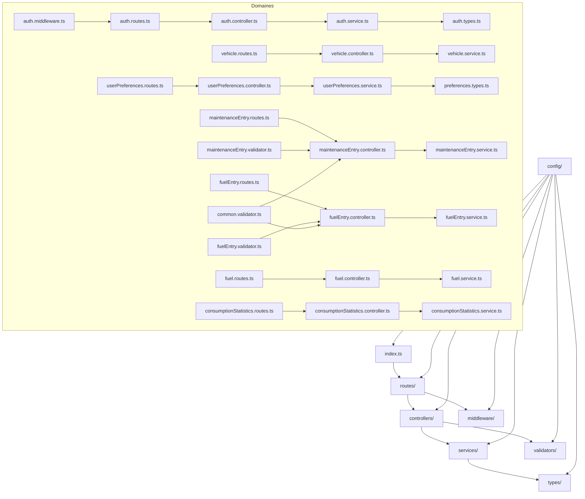

# Architecture Modulaire CareCost

## Vue d'ensemble

CareCost est une application de gestion de coûts d'entretien de véhicules avec une architecture modulaire basée sur Node.js/Express et React.

## Architecture Backend

### Structure des modules

```
src/
├── modules/
│   ├── auth/                 # Authentification et autorisation
│   ├── vehicles/             # Gestion des véhicules
│   ├── fuel/                 # Gestion carburant
│   ├── maintenance/          # Gestion maintenance
│   ├── costs/                # Gestion des coûts et budgets
│   ├── documents/            # Gestion des documents
│   ├── statistics/           # Statistiques et rapports
│   ├── users/                # Gestion des utilisateurs
│   ├── notifications/        # Système de notifications
│   └── integrations/         # Intégrations externes
├── shared/
│   ├── middleware/           # Middlewares partagés
│   ├── validators/           # Validateurs partagés
│   ├── utils/                # Utilitaires
│   └── types/                # Types TypeScript partagés
└── config/                   # Configuration
```

### Modules principaux

#### 1. Module Auth
- Authentification JWT
- Autorisation par rôles (USER, ADMIN, SUPER_ADMIN)
- 2FA (TouchID/FaceID)
- Gestion des sessions
- Middleware d'authentification

#### 2. Module Vehicles
- CRUD véhicules
- Gestion multi-véhicules
- Partage entre utilisateurs
- Distinction fonctionnel/personnel
- Véhicule favori/archivé
- Informations techniques
- Rappels constructeur

#### 3. Module Fuel
- Entrées carburant multi-énergies
- Saisie flexible (montant/volume/prix)
- Historique stations-service
- Auto-complétion
- Prix en temps réel (API)
- Abonnements

#### 4. Module Maintenance
- Rappels kilométrage/date
- Templates prédéfinis/personnalisables
- Garanties
- Carnet d'entretien exportable
- Lien rappels constructeur

#### 5. Module Costs
- Catégories personnalisables
- TCO (Total Cost of Ownership)
- Budgets
- Indicateur cote
- Export PNG/PDF/CSV

#### 6. Module Documents
- OCR reçus
- Stockage sécurisé
- Export PDF
- Gestion des pièces jointes

#### 7. Module Statistics
- Dépenses
- Consommation
- Kilométrage
- CO2
- Comparaisons
- Graphiques exportables

#### 8. Module Users
- Gestion multi-utilisateurs
- Permissions granulaires
- Profils utilisateur
- Préférences

#### 9. Module Notifications
- Notifications push/SMS/email
- Rappels automatiques
- Alertes maintenance

#### 10. Module Integrations
- API externe
- Synchronisation calendriers
- Intégrations tierces

## Architecture Frontend

### Structure des modules

```
client/src/
├── modules/
│   ├── auth/                 # Authentification
│   ├── vehicles/             # Gestion véhicules
│   ├── fuel/                 # Gestion carburant
│   ├── maintenance/          # Gestion maintenance
│   ├── costs/                # Gestion coûts
│   ├── documents/            # Gestion documents
│   ├── statistics/           # Statistiques
│   ├── users/                # Gestion utilisateurs
│   ├── notifications/        # Notifications
│   └── settings/             # Paramètres
├── shared/
│   ├── components/           # Composants partagés
│   ├── hooks/                # Hooks personnalisés
│   ├── services/             # Services API
│   ├── utils/                # Utilitaires
│   └── types/                # Types TypeScript
└── layouts/                  # Layouts de l'application
```

### Composants principaux

#### 1. Module Auth
- Login/Register
- 2FA
- Gestion des sessions
- Middleware de protection

#### 2. Module Vehicles
- Liste des véhicules
- Formulaire véhicule
- Détails véhicule
- Partage véhicule

#### 3. Module Fuel
- Saisie carburant
- Historique
- Statistiques
- Abonnements

#### 4. Module Maintenance
- Saisie maintenance
- Rappels
- Templates
- Export

#### 5. Module Costs
- Tableau de bord coûts
- Budgets
- Catégories
- Export

#### 6. Module Documents
- Upload documents
- OCR
- Visualisation
- Export

#### 7. Module Statistics
- Graphiques
- Rapports
- Comparaisons
- Export

#### 8. Module Users
- Gestion utilisateurs
- Profils
- Permissions

#### 9. Module Notifications
- Centre notifications
- Paramètres
- Historique

#### 10. Module Settings
- Préférences
- Thèmes
- Paramètres avancés

## Base de données

### Schéma modulaire

```sql
-- Module Auth
users
user_sessions
user_roles
permissions

-- Module Vehicles
vehicles
vehicle_shares
vehicle_technical_info
manufacturer_recalls

-- Module Fuel
fuel_entries
fuel_types
gas_stations
subscriptions

-- Module Maintenance
maintenance_entries
maintenance_templates
maintenance_reminders
warranties

-- Module Costs
cost_categories
budgets
cost_entries
tco_calculations

-- Module Documents
documents
document_ocr
document_attachments

-- Module Statistics
statistics_cache
export_history

-- Module Notifications
notifications
notification_settings
notification_history

-- Module Integrations
api_keys
external_integrations
sync_history
```

## Sécurité

### Authentification
- JWT avec refresh tokens
- 2FA (TOTP, TouchID, FaceID)
- Rate limiting
- Session management

### Autorisation
- RBAC (Role-Based Access Control)
- Permissions granulaires
- Vérification propriété ressources

### Données
- Chiffrement des données sensibles
- Validation stricte des entrées
- Protection contre les injections
- Audit trail

### RGPD
- Consentement utilisateur
- Droit à l'oubli
- Export des données
- Suppression des données

## Performance

### Backend
- Cache Redis
- Pagination
- Indexation base de données
- Compression gzip

### Frontend
- Lazy loading
- Code splitting
- Service workers
- Cache stratégique

## Tests

### Backend
- Tests unitaires (Jest)
- Tests d'intégration
- Tests de performance
- Tests de sécurité

### Frontend
- Tests unitaires (Jest)
- Tests d'intégration (Cypress)
- Tests de régression
- Tests d'accessibilité

## Déploiement

### Environnements
- Development
- Staging
- Production

### CI/CD
- GitHub Actions
- Tests automatiques
- Déploiement automatique
- Rollback automatique

### Monitoring
- Logs centralisés
- Métriques de performance
- Alertes automatiques
- Health checks

## Schéma de l'architecture backend

